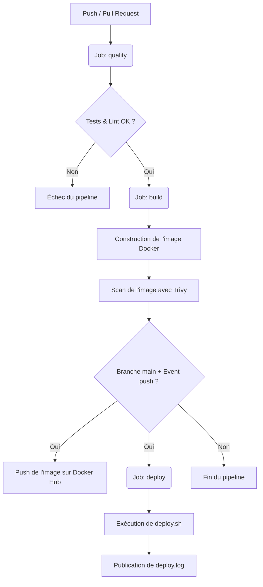

# SkillHub API — Rapport de projet EC06 (CI/CD & Docker)

[](https://github.com/RaphaelBensoussan/EC06_app/actions)

Ce dépôt contient le code de la mini API Express (Node.js 20) conteneurisée avec Docker et intégrée à une chaîne CI/CD complète à l'aide de GitHub Actions, réalisée dans le cadre de l'évaluation EC06.

---

## 📖 Rapport d'Évaluation

### 1. Workflow Git et Docker

#### Stratégie de branches
Pour ce projet, j'ai choisi la stratégie **Trunk-Based Development** (développement basé sur le tronc).
- **Justification** : Étant donné que je travaille seul sur ce projet, le Trunk-Based Development est le choix le plus simple et le plus efficace. Il permet d'éviter la complexité inutile de GitFlow (qui multiplie les branches de développement à long terme comme `develop` ou `release`).
- **Fonctionnement** :
  - La branche principale est `main`. Elle est protégée contre les push directs (la protection est simulée dans ce projet et décrite ci-dessous).
  - Pour chaque tâche, j'ouvre une branche temporaire `feature/<nom-de-la-tache>` (par exemple : `feature/ci-docker`).
  - Une fois les développements terminés et validés, les modifications sont intégrées à `main` via une **Pull Request** sur GitHub.

#### Conteneurisation Docker (Dockerfile)
J'ai conçu un [Dockerfile](Dockerfile) **multistage** (en plusieurs étapes) pour séparer l'environnement de développement et de production :
1. **Étape `builder` (Construction)** : Elle part de l'image de base légère `node:20-alpine`. Elle copie les fichiers de configuration, installe toutes les dépendances via `npm install` (y compris le linter et Jest), puis copie le code source. Elle sert à préparer le build.
2. **Étape `runner` (Production - Image finale)** : Elle repart d'une image vierge `node:20-alpine` pour plus de légèreté. Elle installe uniquement les dépendances de production (`npm install --only=production`), puis copie uniquement le code applicatif (`src`) depuis l'étape `builder`.
   - **Utilisateur non-root** : Par souci de sécurité (éviter de tourner avec les droits root), j'utilise l'instruction `USER node` pour exécuter l'application sous l'utilisateur standard fourni par l'image Alpine.
   - **Port** : L'application écoute par défaut sur le port 3000, qui est documenté avec `EXPOSE 3000`.
   - **Healthcheck** : J'ai ajouté un `HEALTHCHECK` qui lance toutes les 30 secondes un `wget` sur l'url de santé (`http://localhost:3000/health`).

#### Orchestration (docker-compose)
Le fichier [docker-compose.yml](docker-compose.yml) permet de lancer l'application en local très simplement :
- **Service `app`** : Construit à partir du `Dockerfile`, il expose le port 3000, dépend de la base de données et charge ses variables via un fichier `.env`.
- **Service `db`** : Un conteneur PostgreSQL (`postgres:15-alpine`) requis par la consigne pour simuler une base de données.
- **Persistance** : Un volume nommé `pgdata` est attaché au service `db` pour conserver les données de la base de données locale même après l'arrêt des conteneurs.
- **Variables d'environnement** : Le service `app` charge ses variables via un fichier `.env` à l'aide de la directive `env_file`.

---

### 2. Architecture du pipeline CI/CD

Le workflow GitHub Actions est configuré dans le fichier [.github/workflows/ci.yml](.github/workflows/ci.yml). Il s'exécute automatiquement à chaque `push` et lors des `pull_request`.

Voici le schéma du pipeline (flowchart Mermaid) :



- **Job `quality` (Lint + Test)** : S'exécute en premier. Il prépare le fichier d'environnement avec `cp .env.dist .env` puis lance les tests et le linter **à l'intérieur de conteneurs Docker** via `docker compose run`. Les résultats des tests Jest sont sauvegardés et publiés en tant qu'artefact de build.
- **Job `build`** : Se lance après le succès de `quality`. Il construit l'image Docker avec un tag court (SHA) et le tag `latest`.
  - **Scan Trivy (Bonus)** : Analyse de l'image construite pour détecter les vulnérabilités de sécurité critiques et élevées avant publication.
  - **Push Docker Hub (Bonus)** : Si le build s'exécute suite à un push direct ou un merge de PR sur `main`, l'image est automatiquement poussée sur Docker Hub en utilisant des identifiants sécurisés.
- **Job `deploy`** : Se lance après le succès de `build` uniquement sur la branche `main` après un push/merge. Il exécute le script `deploy.sh` qui simule un déploiement SSH en production et génère le fichier `deploy.log` publié comme artefact.

---

### 3. Gestion des secrets et de la sécurité

- **Fichiers d'environnement** :
  - Le fichier `.env` local contient des informations de configuration. Pour éviter toute fuite, ce fichier est inscrit dans [.gitignore](.gitignore) et n'est jamais poussé sur GitHub.
  - À la place, un fichier modèle [.env.dist](.env.dist) sans secrets réels est versionné pour que d'autres développeurs sachent quelles variables définir.
- **Secrets GitHub** :
  - Pour pousser l'image construite sur Docker Hub de manière sécurisée sans exposer mes identifiants, j'ai configuré deux secrets dans le dépôt GitHub (Settings > Secrets and variables > Actions) :
    * `DOCKER_USERNAME` : Mon nom d'utilisateur Docker Hub.
    * `DOCKER_PASSWORD` : Mon jeton d'accès (Access Token) Docker Hub.
- **Protection de branche** :
  - Pour empêcher qu'un développeur pousse du code non testé directement sur `main`, on applique une règle de protection de branche sur GitHub pour forcer le passage de la CI (`Qualite du code (Lint + Tests)`) avant fusion et interdire les pushs directs sur `main`.

---

### 4. Instructions et limites

#### Comment cloner et lancer le projet en local ?
1. Cloner le dépôt :
   ```bash
   git clone <URL_DU_DEPOT_GITHUB>
   cd EC06_app
   ```
2. Créer le fichier d'environnement local à partir du modèle :
   ```bash
   cp .env.dist .env
   ```
3. Lancer l'application et la base de données :
   ```bash
   docker compose up --build
   ```
   *(L'API sera accessible sur http://localhost:3000 et le point de santé sur http://localhost:3000/health)*

#### Limites et améliorations futures
Certaines améliorations n'ont pas été implémentées mais sont tout à fait envisageables :
1. **Cache des dépendances npm** : Ajouter une étape de cache dans GitHub Actions pour réutiliser les dépendances et accélérer le job de build.
2. **Déploiement réel** : Remplacer le script `deploy.sh` simulé par un vrai script SSH utilisant `appleboy/ssh-action` pour déployer l'application sur un serveur VPS.
